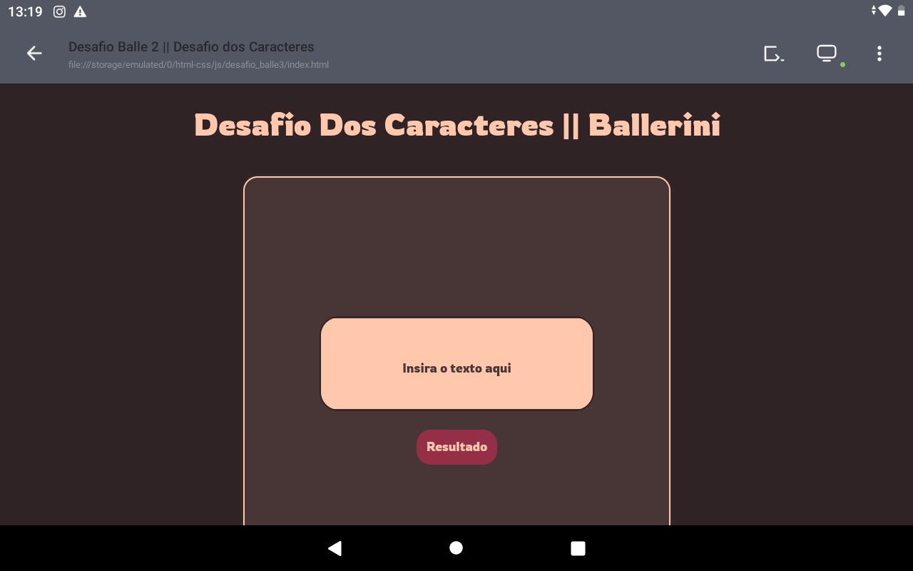

# desafio_balle3
Desafio proposto na comunidade do Discord da Rafaela Ballerini 

## Explicações 
Ok, ok, antes que me julguem por ter usado o layout o mesmo do desafio anterior, deixem-me explicar: acontece que esse foi um dos desafios mais “difíceis” para fazer. Eu não conseguia montar uma lógica que conseguisse cumprir minhas metas, *contudo* depois de alguns estudos aprofundados de métodos de strings e arrays... **desafio concluído com sucesso** ✅

## GitHub Pages 
Você conseguirá testar esse site em 👇
<https://emilsonfilho.gitgub.io/desafio_balle3/> 

## Mais algumas coisas... 👾
Se, assim como o desafio passado, a visualização deste não se der tão bem em seu computador, peço perdão pois ainda não consigo codar em um, então é improvável que fique com um destaque bonito em telas de resoluções maiores. 🌾

Também quero agradecer à comunidade do Discord que se mostrou bem ativa e adepta a ajudar todos os programadores que lá se encontram (inclusive eu)😻

### Feito com 🤍 por [Emilson Filho](https://github.com/emilsonfilho/)
